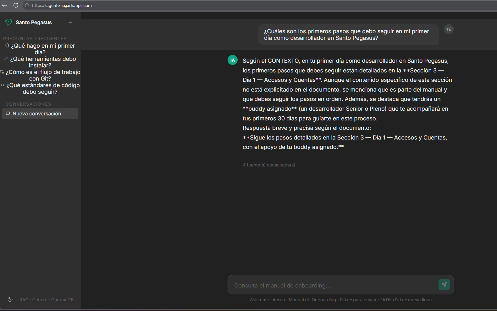

# AGENTE-IA 🤖

Agente conversacional basado en **RAG** (*Retrieval-Augmented Generation*) que responde preguntas en lenguaje natural sobre un documento PDF. La solución expone una **API REST con FastAPI + Uvicorn** y sirve directamente una **interfaz web tipo chat** — todo desde un único servidor en el puerto `8000`.

***

## Descripción general

El sistema procesa un documento PDF configurado por el usuario, lo fragmenta en bloques de texto, genera embeddings semánticos y los almacena en una base vectorial persistente con **ChromaDB**. Cuando el usuario hace una pregunta desde el frontend o via API, el sistema recupera los fragmentos más relevantes y los envía junto con la pregunta al modelo **Cohere** para generar una respuesta precisa y fundamentada.

El frontend está integrado al mismo servidor FastAPI: la ruta raíz `/` sirve el HTML del chat y el directorio `/static` sirve los assets CSS/JS.

***

## Arquitectura de la solución

```text
Navegador (http://localhost:8000)
          │
          │  GET /          → sirve frontend/templates/index.html
          │  GET /static/*  → sirve frontend/static/
          │  POST /api/chat → recibe { message } → devuelve { answer, sources }
          │  GET  /api/health → estado del agente
          ▼
┌─────────────────────────────────┐
│   FastAPI  +  Uvicorn           │
│   src/api/server.py             │
│                                 │
│   init_vectorstore()            │
│   build_qa_chain()              │
└──────────┬──────────────────────┘
           │
    ┌──────▼───────┐     ┌─────────────────┐
    │  loader.py   │     │  embeddings.py  │
    │  PyPDFLoader │     │  ChromaDB       │
    │  TextSplitter│────▶│  CohereEmbed.   │
    └──────────────┘     └────────┬────────┘
                                  │
                         ┌────────▼────────┐
                         │  rag_chain.py   │
                         │  RetrievalQA    │
                         │  ChatCohere     │
                         │  PromptTemplate │
                         └─────────────────┘
```

### Componentes

| Archivo | Responsabilidad |
|---|---|
| `src/api/server.py` | Aplicación FastAPI: monta el frontend estático, expone endpoints REST e inicializa la cadena RAG al arrancar. |
| `src/rag_chain.py` | Construye el `RetrievalQA` con `ChatCohere`, retriever (top-4) y prompt personalizado. |
| `src/embeddings.py` | Genera o carga la base vectorial ChromaDB con embeddings de Cohere. |
| `src/loader.py` | Carga el PDF con `PyPDFLoader` y lo divide en fragmentos. |
| `src/config.py` | Centraliza rutas y parámetros: modelo, embedding, rutas del documento y DB. |
| `src/main.py` | Modo consola interactivo (alternativo al servidor web). |
| `frontend/templates/index.html` | Interfaz de chat servida por FastAPI en la ruta raíz `/`. |
| `frontend/static/` | Assets CSS y JS del frontend. |
| `dockerfile` | Imagen Python 3.11-slim que arranca `uvicorn src.api.server:app`. |

***

## Tecnologías y herramientas

| Tecnología | Uso |
|---|---|
| **FastAPI** | Framework web para la API REST y para servir el frontend. |
| **Uvicorn** | Servidor ASGI que ejecuta la aplicación. |
| **LangChain** | Orquestación del pipeline RAG (`RetrievalQA`, `PromptTemplate`). |
| **langchain-cohere** | Integración con modelos y embeddings de Cohere. |
| **ChatCohere** (`command-a-03-2025`) | Modelo LLM para generación de respuestas. |
| **Cohere Embeddings** (`embed-v4.0`) | Generación de vectores semánticos para indexar fragmentos. |
| **ChromaDB** | Base vectorial persistente para almacenamiento y recuperación. |
| **PyPDF** | Lectura del archivo PDF fuente. |
| **langchain-text-splitters** | División del documento en chunks. |
| **python-dotenv** | Carga de variables de entorno desde `.env`. |
| **Docker** | Contenerización para despliegue en producción. |

***

## Estructura del proyecto

```text
AGENTE-IA/
├── .env.example              ← variables requeridas
├── .gitignore
├── .dockerignore
├── dockerfile                ← imagen Docker lista para producción
├── requirements.txt
├── data/
│   └── documento.pdf         ← coloca aquí tu PDF
├── db/                       ← base vectorial ChromaDB (generada automáticamente)
├── frontend/
│   ├── templates/
│   │   └── index.html        ← interfaz de chat
│   └── static/               ← CSS / JS del frontend
└── src/
    ├── __init__.py
    ├── config.py
    ├── embeddings.py
    ├── loader.py
    ├── main.py               ← modo consola (opcional)
    ├── rag_chain.py
    └── api/
        └── server.py         ← servidor FastAPI principal
```

***

## Instrucciones para ejecutar el proyecto

### Requisitos previos

- Python 3.11+
- Una API Key de [Cohere](https://cohere.com/)
- Un archivo PDF como fuente de conocimiento

### 1. Clonar el repositorio

```bash
git clone https://github.com/fenixreds/AGENTE-IA.git
cd AGENTE-IA
```

### 2. Crear entorno virtual e instalar dependencias

```bash
python -m venv .venv
source .venv/bin/activate        # Windows: .venv\Scripts\activate

pip install -r requirements.txt
```

### 3. Configurar variables de entorno

```bash
cp .env.example .env
```

Edita `.env` con tus valores:

```env
MODEL_NAME=command-a-03-2025
EMBEDDING_MODEL=embed-v4.0
DOCUMENT_PATH=data/documento.pdf
VECTOR_DB_DIR=db
COLLECTION_NAME=documentos_rag
COHERE_API_KEY=tu_api_key_aqui
```

### 4. Colocar el documento PDF

Copia tu archivo PDF dentro de la carpeta `data/` con el nombre configurado en `DOCUMENT_PATH`:

```bash
cp mi_documento.pdf data/documento.pdf
```

### 5. Iniciar el servidor

```bash
uvicorn src.api.server:app --host 0.0.0.0 --port 8000 --reload
```

Al iniciar, el sistema detecta automáticamente si la base vectorial ya existe. Si no existe o está vacía, procesa el PDF y genera los embeddings antes de quedar disponible.

### 6. Abrir la interfaz de chat

Abre tu navegador en:

```
http://localhost:8000
```

La interfaz de chat se carga directamente desde el servidor sin necesidad de pasos adicionales.

### Endpoints disponibles

| Método | Ruta | Descripción |
|---|---|---|
| `GET` | `/` | Sirve la interfaz de chat (frontend). |
| `GET` | `/api/health` | Estado del agente (`{"status": "ok"}`). |
| `POST` | `/api/chat` | Envía una pregunta y recibe respuesta + fuentes. |
| `GET` | `/static/*` | Assets estáticos del frontend (CSS/JS). |

#### Ejemplo de llamada a `/api/chat`

```bash
curl -X POST http://localhost:8000/api/chat \
  -H "Content-Type: application/json" \
  -d '{"message": "¿Cuál es el objetivo principal del documento?"}'
```

Respuesta:

```json
{
  "answer": "El documento tiene como objetivo...",
  "sources": [
    {
      "page": 1,
      "source": "data/documento.pdf",
      "content": "Fragmento recuperado del documento..."
    }
  ]
}
```

***

## Ejecución con Docker

### Construir la imagen

```bash
docker build -t agente-ia .
```

### Ejecutar el contenedor

```bash
docker run -p 8000:8000 \
  -e COHERE_API_KEY=tu_api_key \
  -v $(pwd)/data:/app/data \
  -v $(pwd)/db:/app/db \
  agente-ia
```

Accede en `http://localhost:8000`.

***

## Ejemplos de preguntas que el agente puede responder

Las preguntas deben estar relacionadas con el contenido del PDF configurado. Algunos ejemplos:

- ¿Cuál es el objetivo principal del documento?
- Resume los puntos más importantes.
- ¿Qué conclusiones presenta el documento?
- ¿Qué dice el documento sobre [tema específico]?
- ¿En qué sección se menciona [concepto]?
- ¿Qué recomendaciones o hallazgos se describen?

***

## Ejemplos de respuestas generadas por el agente

Las respuestas dependen del contenido del PDF cargado. El agente está instruido para responder **únicamente con información del documento** y devolver `"No lo sé según el documento."` si la respuesta no aparece en el contexto recuperado.

### Ejemplo 1

**Pregunta:** ¿Cuál es el objetivo principal del documento?

**Respuesta:** El documento tiene como objetivo presentar [contenido del PDF], describiendo su contexto y los elementos clave del análisis.

**Fuentes devueltas:** página 1 — `"Fragmento textual recuperado del PDF..."`

### Ejemplo 2

**Pregunta:** ¿Qué conclusiones presenta el documento?

**Respuesta:** El documento concluye que [hallazgo del PDF], destacando [elemento clave] como resultado principal del análisis presentado.

### Ejemplo 3

**Pregunta:** ¿Qué dice el documento sobre un concepto que no aparece en el PDF?

**Respuesta:** `"No lo sé según el documento."` *(el agente no inventa información ausente del contexto)*

***

## Comportamiento del pipeline RAG

Al recibir una pregunta en `/api/chat`:

1. El `retriever` busca los **4 fragmentos más similares** semánticamente en ChromaDB.
2. Los fragmentos recuperados se inyectan en el `PromptTemplate` como `{context}`.
3. `ChatCohere` genera una respuesta basada exclusivamente en ese contexto con temperatura `0`.
4. La respuesta incluye el campo `sources` con página, ruta del documento y extracto de los fragmentos usados.

***

## Variables de entorno

| Variable | Descripción | Ejemplo |
|---|---|---|
| `COHERE_API_KEY` | API Key de Cohere (obligatoria). | `sk-...` |
| `MODEL_NAME` | Modelo de Cohere para generación. | `command-a-03-2025` |
| `EMBEDDING_MODEL` | Modelo de Cohere para embeddings. | `embed-v4.0` |
| `DOCUMENT_PATH` | Ruta al PDF fuente. | `data/documento.pdf` |
| `VECTOR_DB_DIR` | Directorio de la base vectorial. | `db` |
| `COLLECTION_NAME` | Nombre de la colección en ChromaDB. | `documentos_rag` |


## Evidencia de despliegue

https://agente-ia.jarhapps.com/

